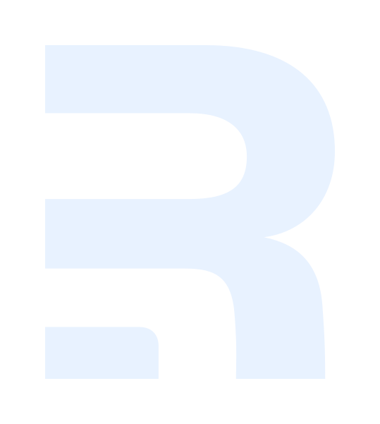

# Hi 👋, I'm Teemu Tontti
> Open to Work!

Third year Business Information Systems student at Tampere University of Applied Sciences.

<!---->

## Status
- 🔭 Working on **[Pearl Satellite Comparer](https://github.com/Pearl-image-comparer/Pearl)**

- 🌱 Learning **CI/CD**, **Cloud Development** and **webpage optimization**

- 📫 Reach me by email: **teemu.tontti.tt@gmail.com** or **[LinkedIn](https://www.linkedin.com/in/tonttiteemu)**

## Statistics

  
  

## Projects

<!--PEARL-->

  <a href="https://github.com/Pearl-image-comparer/Pearl"><h3 style="margin: 0">Pearl - Satellite Comparison</h3></a>
  

    
    
    
    
    
    
    
  

Application for comparing satellite imagery for environmental monitoring and ecosystem protection. <a href="https://ec2-13-60-246-10.eu-north-1.compute.amazonaws.com">Checkout the live version</a> (until the end of February 2025).
  

<!--STAFFAPP-->

  <a><h3 style="margin: 0">StaffApp</h3></a>
  

    
    
    
    
  

Demo application made for finding reliable subtitute workers easily. Not a public project.
  

<!--PORTFOLIO-->

  <a href="https://github.com/Pearl-image-comparer/Pearl"><h3 style="margin: 0">Portfolio Page</h3></a>
  

    
    
    
  

My own website to showcase my previous projects and work experiences. <a href="https://teemutontti.fi">Check out the live version</a>.
  

<!--RECIPE APP-->

  <a href="https://github.com/teemutontti/recipe-app"><h3 style="margin: 0">Recipe App</h3></a>
  

    
    
    
    
    
  

Application for searching recipes, saving you own and viewing today's specials. Currently going through major refactorations to include web-based version with shared backend.
  

## Languages and Tools

> Here I have listed some languages and tools I have used over the years.

### Programming Languages

  
  
  
  
  
  
  
  
  

### Frameworks and Libraries

  
  
  
  
  
  
  
  
  
  
  

### Databases

  
  
  
  

### Tools and Platforms

  
  
  
  
  
  
  

### IDEs and Editors

  
  
  
  
  

### Others

 
<a href="https://www.freepik.com/free-vector/colourful-illustration-programmer-working_5483080.htm#fromView=search&page=1&position=0&uuid=82decf55-7274-4dd3-807e-5ef119c00086">Header image by freepik</a>
